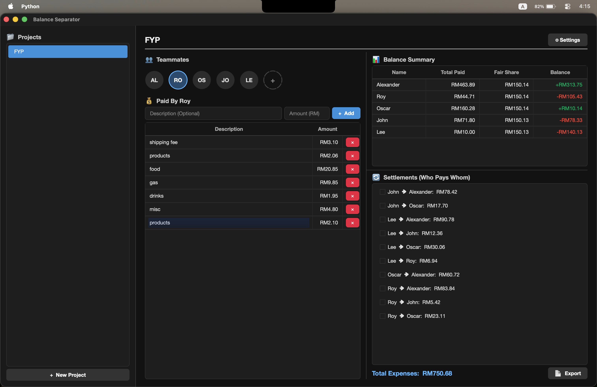

# Balance Separator ⚖️💸

Balance Separator is a fast, offline desktop application built with Python and PyQt6. It is designed to effortlessly calculate group expenses, figure out everyone's fair share, and generate precise pairwise settlements so you know exactly **who owes whom**. 

Perfect for road trips, shared house expenses, or collaborative projects.



## ✨ Features

### 👥 Teammate & Profile Management
* **Custom Avatars:** Upload profile pictures for teammates. Images are automatically compressed and circularly cropped to keep the app lightweight.
* **Inline Editing:** Right-click to edit names, descriptions, or update/remove profile pictures.
* **Persistent State:** All project data and teammates are automatically saved to a local JSON file (`projects.json`).

### ⚡ Rapid Expense Entry
* **Smart Input Navigation:** Typing numbers in the description field automatically jumps to the Amount field. Typing letters in an empty Amount field jumps to the Description.
* **Enter-to-Save:** Press `Enter` in the amount field to instantly record the expense.
* **Inline Editing:** Double-click any expense description in the table to quickly fix typos without deleting the entry.

### 🧮 Flawless Financial Logic
* **Zero Precision Errors:** All background calculations are performed in integers (cents) to prevent floating-point rounding errors. 
* **Pairwise Settlements:** The algorithm calculates exact proportional debts between specific individuals (e.g., "Person A owes Person B exactly RM12.36").
* **Payment Tracking:** Tick the checkbox next to a settlement to mark it as paid. This state is saved automatically and crosses out the text visually without altering the math.

### 🎨 Modern UI/UX
* **Light & Dark Mode:** Toggle seamlessly between themes via the settings menu. 
* **Customizable Layout:** The interface features resizable splitters for the sidebar and content columns. Your layout preferences are saved automatically (`config.json`).
* **Clean Interface:** Scrollbars are completely hidden for a sleek, modern look (mouse-wheel/trackpad scrolling remains fully functional).

### 📄 Exporting & Reporting
* **PDF Export:** Generates a 2-page clean PDF report containing the balance summary, settlements, and a detailed list of all expenses.
* **Excel Export:** Exports data cleanly into formatted Excel (`.xlsx`) sheets for further accounting.

---

## 🚀 Installation & Setup

This project does not have strict Python version limits (Tested on Python 3.14) but requires a modern Python 3.x environment.

### 1. Clone the repository
```bash
git clone https://github.com/arinltte/Balance-Separator.git
cd balance-separator
```

### 2. Create a Virtual Environment (Recommended)
**For macOS/Linux:**
```bash
python3 -m venv venv
source venv/bin/activate
```
**For Windows:**
```cmd
python -m venv .venv
.venv\Scripts\Activate.ps1
```

### 3. Install Dependencies
Install the required libraries using `pip`:
```bash
pip install PyQt6 pandas openpyxl
```
or
```bash
pip install -r requirements.txt
```
*Note: `PyQt6` is used for the Graphical User Interface. `pandas` and `openpyxl` are required for exporting data to Excel.*

### 4. Run the Application
```bash
python balance_gui.py
```

---

## 📂 File Structure

* **`balance_gui.py`**: Contains all UI rendering, stylesheets, event handling, and window logic.
* **`balance_logic.py`**: The backend brain. Handles dataclasses, file saving/loading, and the core mathematical settlement algorithms.
* **`projects.json`**: Auto-generated file where all your project data is stored.
* **`config.json`**: Auto-generated file storing your layout sizes and theme preferences.

---

## 🤝 Contributing
Contributions, issues, and feature requests are welcome! Feel free to check the [issues page](../../issues). 

1. Fork the Project
2. Create your Feature Branch (`git checkout -b feature/AmazingFeature`)
3. Commit your Changes (`git commit -m 'Add some AmazingFeature'`)
4. Push to the Branch (`git push origin feature/AmazingFeature`)
5. Open a Pull Request

---

## 📜 License
Distributed under the MIT License. See `LICENSE` for more information.

<p align="center">
  <i>2026 Developed by Chen Jin Shen, cjshen00@gmail.com</i>
</p>
