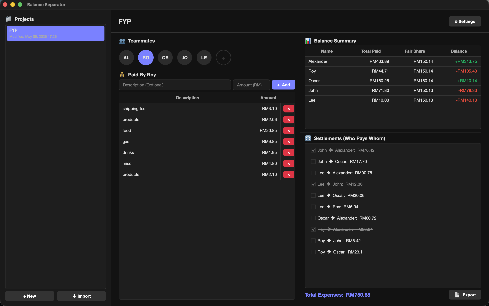

# Balance Separator ⚖️💸

Balance Separator is a fast, offline-first, locally-networked desktop application designed for precise group expense calculation and debt settlement. Engineered in Python, it provides a robust mathematical engine to process shared expenses and a secure peer-to-peer networking layer for real-time collaboration on a Local Area Network (LAN). Effortlessly calculate group expenses, figure out everyone's fair share, and generate precise pairwise settlements so you know exactly **who owes whom**. 

Perfect for road trips, shared house expenses, or collaborative projects!



## 🏗️ Core Architecture & Technical Features

### 🌐 Peer-to-Peer Local Network Synchronization
* **Zero-Configuration Discovery:** Utilizes UDP broadcasting for automatic host discovery within a local subnet.
* **TCP Payload Delivery:** Real-time state synchronization is handled via dedicated TCP sockets. The architecture supports up to 50 concurrent client connections per host.
* **Network Serialization:** Complex state objects, including binary file attachments, are dynamically serialized into JSON payloads (with Base64 encoding for binaries) and reconstructed seamlessly on client machines.

### 🔒 Security & Protection Mechanisms
* **Cryptographic Payload Encryption:** Network payloads for password-protected projects are secured using symmetric encryption (`cryptography.fernet`).
* **Robust Key Derivation:** Passwords are mathematically hashed and salted using `PBKDF2HMAC` (SHA256) with 50,000 iterations to thwart fast-hashing and brute-force attacks.
* **Brute-Force & Flood Protection:** Host instances strictly track authentication attempts per IP address, enforcing a temporary lockout (30 seconds) after 10 failed attempts.
* **Memory & Buffer Safety:** Hardcoded maximum network payload limits (50MB per packet) prevent buffer overflow and out-of-memory denial-of-service (DoS) scenarios.
* **Path Traversal Blocking:** File I/O operations utilize strict sanitization (`safe_path_resolve`) to aggressively block directory traversal (`../`) vulnerabilities when saving incoming network attachments.

### 🧮 Algorithmic Financial Logic
* **Zero Precision Errors:** All financial background calculations are strictly processed in integers (cents) to entirely eliminate floating-point arithmetic rounding errors.
* **Optimized Settlement Engine:** Employs a Greedy Algorithm to calculate the absolute minimum number of pairwise transfers required to settle all debts across `n` participants.
* **Stateful Debt Tracking:** Supports complex, incremental settlement logic tracking. Differentiates between automatically calculated remaining balances and historically tracked "manual" or "completed" settlements.

### 💾 Data Integrity & Export Pipelines
* **Offline-First Storage:** Local user data relies on standard JSON for lossless serialization.
* **Document Generation:** Includes native modules to parse project state arrays and compile them into formatted PDF reports or Excel (`.xlsx`) spreadsheets.

---

## 📂 Project Structure & Separation of Concerns

The codebase enforces a strict separation of logic, networking, and presentation layers:
* `logic_models.py` — Dataclass definitions defining the state schemas (Expenses, Teammates, Projects).
* `logic_project.py` — File I/O, mathematical settlement engines, and local state management.
* `logic_network.py` — The core TCP/UDP network engine, cryptography implementation, and socket handling.
* `config.py` — Global environment constants, path resolution, and security sanitization functions.
* `main.py` / `gui_*.py` — Application entry point, thread dispatching, and frontend view rendering.

**Data Storage Directories:**
To ensure cross-platform compatibility without requiring elevated privileges, all state and attachment files are stored within the standard user directory space:
* **macOS/Linux:** `~/.balance_separator/`
* **Windows:** `C:\Users\YourName\Documents\BalanceSeparator\`

---

## 🚀 Installation & Setup

This application requires a modern Python 3.10+ environment.

### 1. Clone the repository
```bash
git clone https://github.com/arinltte/Balance-Separator.git
cd Balance-Separator
```

### 2. Create a Virtual Environment
**For macOS/Linux:**
```bash
python3 -m venv venv
source venv/bin/activate
```
**For Windows:**
```cmd
python -m venv .venv
.venv\Scripts\Activate.ps1
```

### 3. Install Dependencies
Install the required libraries using `pip`:
```bash
pip install -r requirements.txt
```

### 4. Run the Application
```bash
python main.py
```

---

## 🤝 Contributing
Contributions, architecture improvements, and security audits are highly encouraged!

1. Fork the Project
2. Create your Feature Branch (`git checkout -b feature/OptimizationLogic`)
3. Commit your Changes (`git commit -m 'Implement optimization logic'`)
4. Push to the Branch (`git push origin feature/OptimizationLogic`)
5. Open a Pull Request

---

## 📜 License
Distributed under the MIT License. See `LICENSE` for more information.

<p align="center">
  <i>Developed by arinltte, cjshen00@gmail.com</i>
</p>
